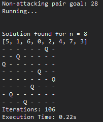

# N-Queens Problem Solver
The N-Queens Problem involves placing N queens on a NxN chessboard. This program will take two inputs:
1. N queens to solve for.
2. k states for use with a genetic algorithm.

The program generates k random states of the chessboard. We know how many non-attacking pairs we need for a solution e.g. n=8, there need to be 28 non-attacking pairs.

We check each of the randomely generated states for how many non-attacking pairs they have. We take the two highest scoring states accprding to a fitness function and "splice" them by swapping half of the two states with each other. The states are then tested again. When we calculate the correct amount of non-attacking pairs, we print the solution to the console.

n=8 (real chessboard) can be solved in less than one second. It can solve for n=50 in two to four minutes.

Written in Python.

## Images
